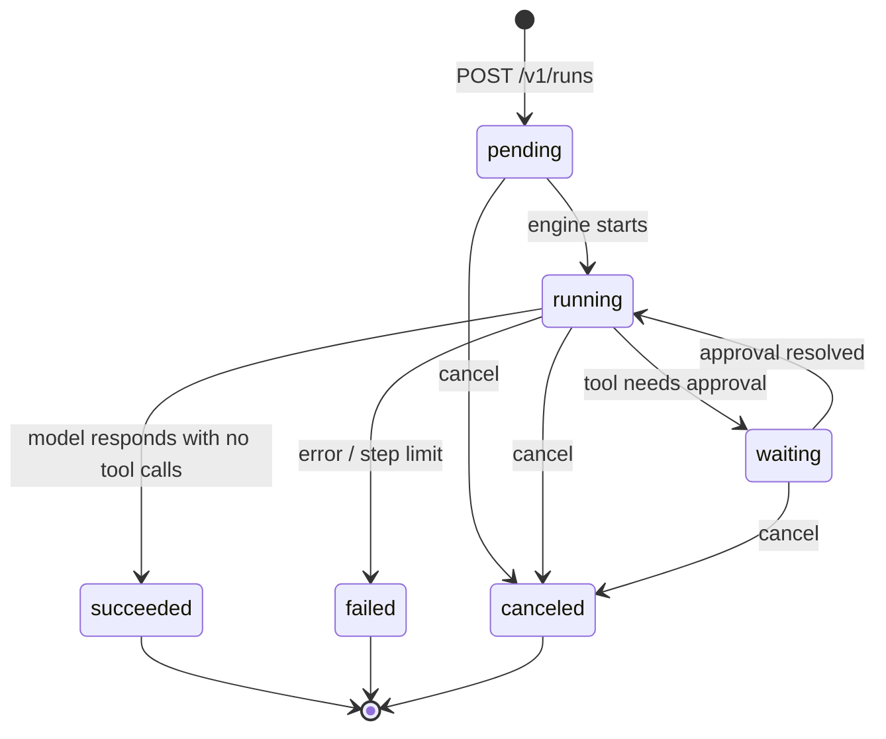

# Relay architecture

Relay is a durable execution harness for tool-using LLM workflows, written in Go on PostgreSQL. This document explains exactly how it works: the data model, the execution engine, the durability and recovery mechanics, the approval gate, and the HTTP surface.

The design position in one sentence:

> The model proposes actions. The harness owns validation, authorization, execution, persistence, limits, and observation.

Everything below is a consequence of that sentence plus one storage rule: **events are immutable facts; run state is a mutable projection derived from them.**

## Contents

- [Processes](#processes)
- [Package layout](#package-layout)
- [Data model](#data-model)
- [Run lifecycle](#run-lifecycle)
- [The event log](#the-event-log)
- [The engine loop](#the-engine-loop)
- [Durable checkpoints and recovery](#durable-checkpoints-and-recovery)
- [The effect ledger](#the-effect-ledger)
- [Policy and the durable approval gate](#policy-and-the-durable-approval-gate)
- [Cancellation](#cancellation)
- [Bounded model context](#bounded-model-context)
- [HTTP API](#http-api)
- [Failure model](#failure-model)
- [Testing strategy](#testing-strategy)

## Processes

The repository builds three binaries:

| Binary | Role |
| --- | --- |
| `cmd/api` | HTTP/SSE server over the PostgreSQL store: run projections, event pages, live event stream, and the create / cancel / approval commands. |
| `cmd/relay` | Deterministic in-memory demo of the engine loop with a scripted model and lookup tools. |
| `cmd/relayctl` | Read-only CLI that pages through the durable event log (`events [-run id] [-after seq]`). |

Two boundaries matter:

- **The API does not execute workflows.** `POST /v1/runs` atomically records a durable `pending` run and its `workflow.queued.v1` event, then returns. Execution belongs to a worker process driving `workflow.Engine`; the request path never holds a workflow.
- **The engine does not own transport.** `workflow.Engine` is a library composed with a `model.Client`, a `tool.Registry`, a policy, and the store. Integration tests compose it against PostgreSQL; `cmd/relay` composes it in memory.

## Package layout

```text
cmd/api/            configured HTTP/SSE server with graceful shutdown
cmd/relay/          deterministic in-memory workflow demo
cmd/relayctl/       read-only event log inspection
internal/run/       run identity, status, guarded state transitions
internal/event/     immutable safe event envelope and typed payloads
internal/model/     provider-independent model port and scripted fake
internal/tool/      tool contract, registry, declared authority, demo tools
internal/policy/    authority allowlist producing allow/deny/require_approval
internal/workflow/  engine loop, checkpoints, approval gate, context budget
internal/postgres/  pgx pool and explicit-SQL store (no ORM)
migrations/         Goose schema migrations
```

Dependencies point inward: `workflow` orchestrates `model`, `tool`, `policy`, `event`, and `run`; `postgres` implements storage; `httpapi` projects storage over HTTP. The model and tool boundaries are interfaces, so tests replace them with deterministic fakes.

## Data model

Six tables, created by Goose migrations, all accessed through explicit SQL in `internal/postgres`:

| Table | Purpose | Key constraints |
| --- | --- | --- |
| `runs` | Mutable projection of each run's current status | status `CHECK` over the six lifecycle states |
| `events` | Append-only ordered log of everything that happened | `sequence` is `GENERATED ALWAYS AS IDENTITY`; a `BEFORE UPDATE OR DELETE` trigger raises `events are append-only`; payload capped at 8 KiB |
| `steps` | One durable checkpoint per logical workflow operation | `PRIMARY KEY (run_id, step_key)`; 32-byte input hash; `running` rows must have no result, `completed` rows must have one |
| `effects` | Ledger of completed external side effects | `idempotency_key` is the primary key — one row per logical effect, ever |
| `approval_requests` | Durable human-approval state | partial unique index allows **one pending request per run**; `UNIQUE (run_id, call_id)` |
| `approval_signals` | The first recorded decision per request | `request_id UNIQUE` — first writer wins, forever |

The `events.sequence` identity column is the single global ordering cursor. Every read path — run event pages, the SSE stream, `relayctl` — pages with `WHERE sequence > $after ORDER BY sequence LIMIT 100`, so a cursor is always resumable and never skips or repeats.

## Run lifecycle

`internal/run` guards the state machine in memory; the store enforces the same transitions in SQL (every status `UPDATE` carries a `WHERE status = <expected>` clause and checks `RowsAffected`).



`waiting` is a durable database state, **never a blocked goroutine** — see the approval gate below. `succeeded`, `failed`, and `canceled` are terminal; the store rejects any transition out of them.

## The event log

Every observable fact is an `event.Envelope`: `id`, `runId`, `stepKey`, `type`, `occurredAt`, and a typed JSON payload. Types are versioned strings:

```text
workflow.queued.v1  workflow.started.v1  workflow.completed.v1
workflow.failed.v1  workflow.cancelled.v1
model.requested.v1  model.completed.v1   model.failed.v1
tool.requested.v1   tool.completed.v1    tool.failed.v1   tool.denied.v1
approval.requested.v1  approval.resolved.v1
memory.compacted.v1
```

Payloads are deliberately **safe by construction**. They carry identity and status — a run status, a tool name and call ID, an approval decision, evicted/retained message *counts* — never prompt text, tool output, or credentials. The envelope rejects payloads over 8 KiB, and the database enforces the same cap. The event log can therefore be exposed to an operator UI verbatim, with no redaction pass.

Model conversation content lives only in the `steps` checkpoint results, which no event or API response exposes.

## The engine loop

`workflow.Engine.Execute` runs a bounded propose–execute loop. Per iteration (up to `MaxSteps`):

1. **Check cancellation.** A canceled context transitions the run to `canceled` and records `workflow.cancelled.v1`.
2. **Compact history if over budget** (optional, see [Bounded model context](#bounded-model-context)).
3. **Hydrate the model request**: pinned original messages + current summary + the newest history suffix that fits the byte budget.
4. **Call the model** through a checkpoint keyed `model/<step>`. Events: `model.requested.v1` → `model.completed.v1` / `model.failed.v1`.
5. **If the response has no tool calls, the run succeeds** — that is the loop's only success exit.
6. **For each proposed tool call**, keyed `tool/<step>/<call-id>`:
   - Look up the tool's *registered* spec. Policy decides on the **declared authority stored in the registry, not the model-proposed name** — a model cannot talk its way past policy by naming a tool creatively.
   - `deny` → record `tool.denied.v1` and feed the model a denial result; the loop continues.
   - `require_approval` → consult the durable approval gate. Pending means `Execute` returns `ErrApprovalPending` immediately. Rejected feeds the model a rejection result without ever resolving the executable.
   - `allow` (or approved) → execute through a checkpoint with a per-call timeout, record `tool.requested.v1` → `tool.completed.v1` / `tool.failed.v1`, append the tool result to history.
7. Exhausting `MaxSteps` fails the run — a model that never converges cannot loop forever.

Step keys are stable and derived from position (`workflow`, `model/2`, `tool/2/call_credit`, `memory/summary/3`), which is what makes re-execution after a crash line up with the checkpoints of the previous attempt.

## Durable checkpoints and recovery

`workflow.StepRunner` wraps every model call and tool call in a checkpoint against the `steps` table:

```text
Run(runID, stepKey, input, execute):
    hash  = sha256(serialized input)
    claim = INSERT ... ON CONFLICT (run_id, step_key) DO NOTHING
    if existing row: verify input hash matches
    if status = completed:  return stored result   -- execute() never runs
    if status = running:    execute(), then
        UPDATE ... SET completed WHERE attempt = <claimed> AND status = 'running'
```

The mechanics that make this safe:

- **Input hashing.** The full serialized model request or tool call is hashed. A checkpoint only replays for the *same* input; a mismatch is an explicit `ErrStepInputMismatch`, never a silently wrong result.
- **Attempt fencing.** A recovering process (`Recover: true`) bumps `attempt` on a `running` checkpoint before re-executing. Completion requires the exact claimed attempt, so a stale worker that lost its claim cannot overwrite the current attempt's result.
- **Replay vs. retry.** A *completed* checkpoint is replay-safe: recovery returns the recorded JSON result and makes zero model or tool calls (integration tests close the first PostgreSQL pool mid-run and assert exactly this). An *interrupted* attempt is a retry — the work runs again, which is why external effects need the ledger below.

## The effect ledger

Relay does not claim exactly-once external side effects; it makes the honest guarantee instead. The crash window that matters: a tool performs its side effect, then the process dies **before** the checkpoint completes. Retry will re-execute the tool.

The `effects` table collapses that retry into one logical effect:

- The demo `issue_credit` tool derives a stable idempotency key from harness-owned identity — `issue_credit/<run-id>/<step-key>` — never from model-proposed arguments.
- `RecordEffect` is `INSERT ... ON CONFLICT (idempotency_key) DO NOTHING`; on conflict it returns the originally recorded result (after verifying the key belongs to the same run, step, and effect type).
- So the retried tool call finds the recorded credit and returns it instead of issuing a second one. An integration test interrupts exactly inside this crash window, reopens the pool, and proves attempt two completes with one logical credit.

The precise contract: **completed checkpoints replay without side effects; interrupted attempts retry at-least-once, and the idempotency ledger collapses those retries into one recorded effect.**

## Policy and the durable approval gate

Tools register with a validated declared authority: `read` or `effect`. `policy.Allowlist` maps authority to a decision — `allow`, `deny`, or `require_approval` — and missing policy is deny by default.

When a tool call requires approval, `workflow.ApprovalGate.Evaluate` runs:

**First encounter** — one transaction:
1. Transition the run `running → waiting` (guarded UPDATE).
2. Insert a pending `approval_requests` row with a stable derived ID: `approval/<run-id>/<step-key>`.
3. Append `approval.requested.v1`.

All three commit or roll back together (an injected event-insert failure proves the rollback). The engine then returns `ErrApprovalPending` and the process is free to exit — the wait is a row, not a goroutine.

**Resolution** — `Store.ResolveApproval`, one transaction:
1. `SELECT ... FOR UPDATE` locks the request.
2. Insert the decision into `approval_signals` (`request_id UNIQUE` — the first decision wins permanently).
3. Flip the request `pending → approved/rejected` and the run `waiting → running`.
4. Append `approval.resolved.v1`.

A duplicate matching decision is idempotent and returns success; a conflicting decision fails explicitly with a conflict.

**Re-execution after resolution**: the engine re-runs the workflow. Completed model/tool checkpoints replay from storage, and when it reaches the gated call, the gate finds the stored request — `approved` executes the original checkpointed call; `rejected` hands the model a safe rejection message without resolving the executable. Integration tests restart the process while pending and again after the signal.

## Cancellation

Two cooperating paths:

- **Store-level** (`CancelRun`, used by the API): lock the run `FOR UPDATE`, allow `pending`/`running`/`waiting`, mark any pending approval request `canceled`, set the run `canceled`, append `workflow.cancelled.v1` — one transaction. Terminal runs return an explicit "already terminal" conflict.
- **Engine-level**: the loop checks context cancellation before each model call, and model/tool call errors are inspected for `context.Canceled`, transitioning the run to `canceled` rather than `failed`.

## Bounded model context

Full history is durable; the model's context is reconstructed and bounded on every call.

- `ContextHydrator` rebuilds each request from the pinned original messages plus the newest contiguous suffix of accumulated history that fits a serialized-byte budget (default 16 KiB). It never splits a message and rejects a pinned task that alone exceeds the budget.
- `CompactionPlanner` (opt-in, paired with `SummaryStep`) splits over-budget history into an evicted oldest prefix and a retained newest suffix at a lower watermark, always keeping the latest message verbatim.
- `SummaryStep` summarizes the evicted prefix through its own stable checkpoint (`memory/summary/<turn>`), so a crash mid-summarization recovers like any other step. The rolling summary is injected as a system message next to the pins.
- The only event recorded is `memory.compacted.v1` with evicted/retained *counts* — summary text never enters the event log.

## HTTP API

`cmd/api` serves `internal/httpapi` on `127.0.0.1:4000` by default (flag `-addr`, env `RELAY_API_ADDR`; `DATABASE_URL` required). Read and header timeouts are bounded; the write timeout is intentionally unset so SSE connections can live indefinitely; shutdown drains through a 20-second signal-driven grace period.

| Endpoint | Semantics |
| --- | --- |
| `POST /v1/runs` | Atomically create a `pending` run + `workflow.queued.v1`. Server owns run/event identity and time. `201` + `Location`. |
| `GET /v1/runs` | Newest-first run projections (up to 100), each joined with its pending approval if one exists. |
| `GET /v1/runs/{id}` | One run projection + pending approval. |
| `GET /v1/runs/{id}/events?after=N` | One bounded page (≤100) of the run's events after the exclusive cursor, plus a deterministic `nextAfter`. |
| `POST /v1/runs/{id}/cancel` | Server-built cancellation event into the atomic cancel transaction. `404` missing, `409` already terminal. |
| `POST /v1/runs/{id}/signals/approval` | `{requestId, decision}` with `decision ∈ approved\|rejected`. Duplicate matching decision returns the same success; conflict is `409`. |
| `GET /v1/events/stream?after=N` | The global event log as SSE. |

Command bodies are capped at 8 KiB with unknown fields rejected. Storage errors map to a generic `internal server error` — internal detail (including connection strings) never leaks into responses.

**SSE contract:** each frame's `id:` is the database `sequence` and `data:` is the stable event JSON. The server polls the store (1-second interval) rather than holding notification state, and treats `?after=N` as the only resume cursor — a reconnecting client passes its last received sequence and resumes strictly after it, getting every event exactly once in order. Client identity, subscriptions, and filtering are deliberately absent: the stream is a projection of one global durable log.

## Failure model

The design treats these as normal cases, not exceptions:

| Scenario | Behavior |
| --- | --- |
| Process crash after a step completed | Recovery replays the stored result; no model/tool re-invocation |
| Process crash mid-step | Attempt increments and the step retries; effects deduplicate via the ledger |
| Stale worker finishing a lost claim | Completion requires the claimed attempt number — the update matches zero rows |
| Same step re-run with different input | Explicit input-hash mismatch error, never a wrong replay |
| Duplicate approval decision | Idempotent success if matching, explicit conflict if not |
| Crash while waiting for approval | Nothing to lose — waiting is a database row; restart re-derives the state |
| Cancel racing completion | Row locks + guarded status updates; exactly one transition wins |
| Model never converging | `MaxSteps` bound fails the run |
| Oversized payload | Rejected at the envelope, the HTTP body reader, and the database `CHECK` |

## Testing strategy

- **Unit tests** run the full engine loop with a scripted `model.Client` and deterministic tools — no network, no database, fully reproducible.
- **Integration tests** (`make test-integration`, build tag `integration`) run against the migrated Compose PostgreSQL and prove the durability claims by construction: closing the first connection pool mid-run, reopening, and asserting recovery behavior (zero model calls after completion, one logical credit across an interrupted effect, approval state surviving restart).
- **Race and lint gates** (`make check`) run the full suite with `-race` and `golangci-lint`.

The recurring pattern: every durability claim in this document is backed by a test that kills the first process (by closing its pool) at the exact boundary the claim protects.
